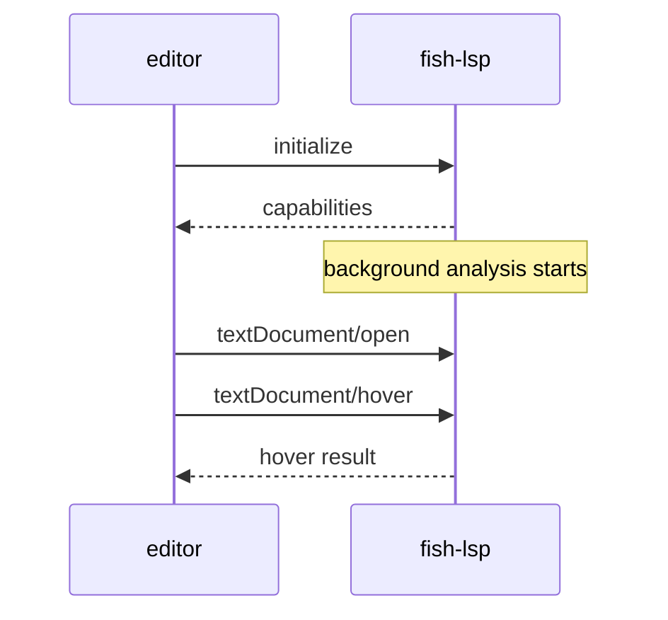
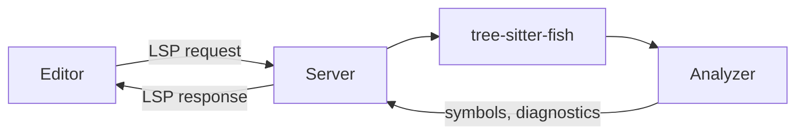

# How It Works

`fish-lsp` is a TypeScript implementation of the Language Server Protocol that
uses [tree-sitter](https://tree-sitter.github.io/tree-sitter/) to parse fish
scripts into concrete syntax trees.

## Parsing

The server uses [web-tree-sitter](https://github.com/tree-sitter/tree-sitter/tree/master/lib/binding_web)
via a compiled `tree-sitter-fish.wasm` module. Each document is parsed into a CST
on open and re-parsed incrementally on change.

## Workspace Analysis

On startup, `initiateBackgroundAnalysis()` crawls all autoloaded fish paths
(by default, `~/.config/fish`, `/usr/share/fish`) and caches symbol tables — without blocking
the connection handshake.

You can change how much extra workspace analysis is done by setting the environment variables:

```fish prompt
set -gx fish_lsp_all_indexed_paths # ~/.config/fish /usr/share/fish
```

```fish prompt
set -gx fish_lsp_single_workspace_support # true false
```


## Symbol Resolution

The `fish-lsp` is able to resolve symbols in the current document and across the workspace. 

For example, in the following snippet, the `echo` command resolves to the outer `x` variable, not the inner one defined inside `foo()`.

```fish
set x 1        # x defined here
function foo
  set x 2      # x shadowed inside foo
end
echo $x        # resolves to outer x
```

References queries strip locally-redefined symbols from global matches.

## LSP Lifecycle



The server speaks JSON-RPC 2.0 over stdio. Connect with: `fish-lsp start`.

## Configuration

Override workspace paths via client initialization options:

```json
{
  "initializationOptions": {
    "workspaces": {
      "paths": {
        "defaults": ["~/.config/fish", "/usr/share/fish"]
      }
    }
  }
}
```

See [Client Configurations](/docs/client-configurations) for per-editor examples.

## Request flow


